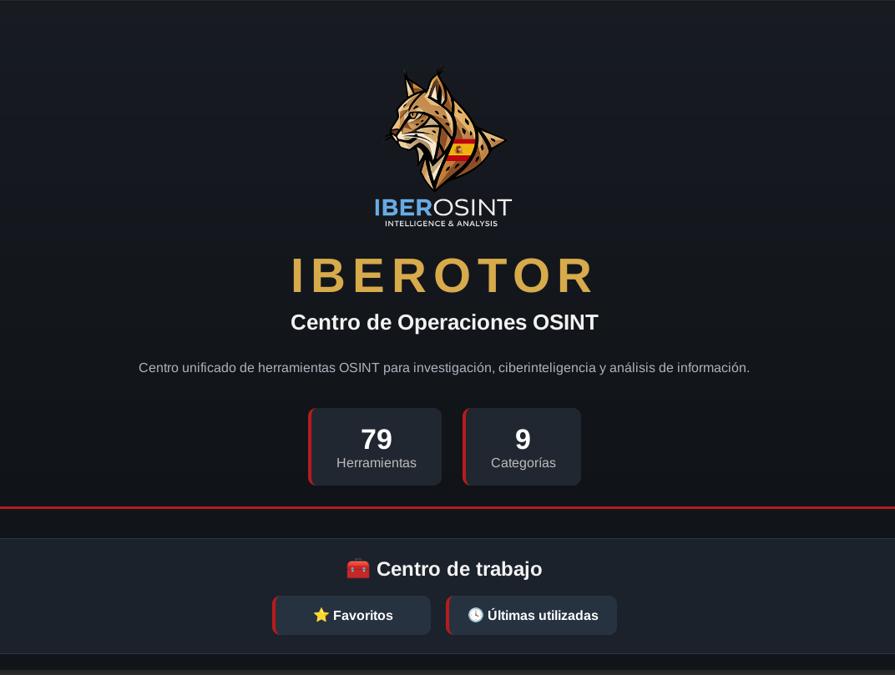
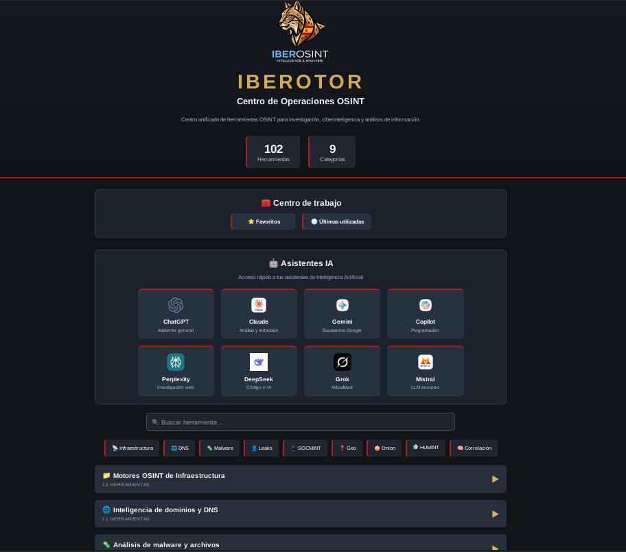
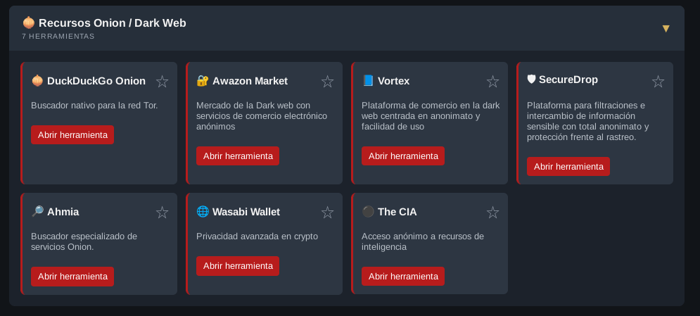

<p align="center">
  
</p>

<h1 align="center">IberoTOR</h1>

<p align="center">
<b>Entorno OSINT especializado para investigaciones anónimas mediante Tor Browser</b><br>
Acceso centralizado a recursos Onion, inteligencia de fuentes abiertas y herramientas para investigaciones que requieren privacidad.
</p>

<p align="center">

<a href="README.en.md">🇬🇧 English</a> | <b>🇪🇸 Español</b>

</p>

<p align="center">


</p>

---

# ¿Qué es IberoTOR?

**IberoTOR** es una plataforma OSINT desarrollada sobre Tor Browser que proporciona un entorno de trabajo centralizado para investigaciones donde el anonimato y el acceso a servicios de la red Tor constituyen un requisito operativo.

La aplicación reúne recursos especializados accesibles tanto desde la Internet convencional como desde servicios Onion, organizándolos en una homepage diseñada para agilizar el trabajo del investigador.

Más que un navegador configurado, IberoTOR proporciona un espacio de trabajo estructurado orientado a investigaciones OSINT, Threat Intelligence y análisis de información en entornos donde la privacidad desempeña un papel fundamental.

---

# Origen del proyecto

IberoTOR forma parte del ecosistema **IberOSINT** y surge como complemento natural de IberoFirefox.

Mientras IberoFirefox centraliza recursos accesibles desde navegadores convencionales, IberoTOR amplía ese concepto incorporando servicios específicos de la red Tor y recursos que únicamente pueden consultarse mediante navegación anónima.

Ambas aplicaciones comparten una filosofía de diseño común, pero están orientadas a escenarios de investigación diferentes.

---

# Filosofía

El desarrollo de IberoTOR se basa en cinco principios fundamentales:

- Centralizar recursos OSINT accesibles mediante Tor.
- Facilitar investigaciones que requieren anonimato.
- Reducir el tiempo de búsqueda de recursos especializados.
- Mantener una organización clara y homogénea.
- Integrarse de forma transparente con el ecosistema IberOSINT.

---

# Casos de uso

IberoTOR ha sido diseñado para apoyar investigaciones donde la privacidad resulta especialmente importante.

Entre sus principales escenarios de utilización destacan:

- Investigaciones OSINT avanzadas.
- Threat Intelligence.
- Acceso a servicios Onion.
- Investigación sobre la Dark Web.
- Verificación de información publicada en servicios ocultos.
- Recopilación de inteligencia de fuentes abiertas.
- Apoyo a investigaciones de ciberseguridad.

---

# Flujo de trabajo

```

                  IberOSINT Launcher
                           │
                           ▼
                     Launch IberoTOR
                           │
                           ▼
                Custom OSINT Homepage
                           │
          ┌────────────────┼────────────────┐
          │                │                │
          ▼                ▼                ▼
   Surface Web       Onion Services     OSINT Tools
          │                │                │
          └────────────────┼────────────────┘
                           ▼
                    Intelligence Gathering

```

IberoTOR proporciona un punto de acceso único para consultar recursos distribuidos entre Internet convencional y la red Tor, reduciendo el tiempo necesario para localizar herramientas durante una investigación.

---

---

# Arquitectura

IberoTOR ha sido desarrollado como un entorno de investigación modular basado en Tor Browser.

La plataforma centraliza recursos OSINT, servicios Onion y herramientas especializadas dentro de una homepage personalizada diseñada para reducir el tiempo necesario para localizar información durante una investigación.

```

                 +----------------------+
                 |    IberOSINT         |
                 |      Launcher        |
                 +----------+-----------+
                            |
                            ▼
                 +----------------------+
                 |      IberoTOR        |
                 +----------+-----------+
                            |
                            ▼
                 +----------------------+
                 | Custom Homepage      |
                 +----------+-----------+
                            |
      +---------------------+----------------------+
      |                     |                      |
      ▼                     ▼                      ▼
 Surface Web         Onion Resources        OSINT Categories
      |                     |                      |
      +---------------------+----------------------+
                            ▼
                  Intelligence Gathering

```

La arquitectura mantiene una experiencia de uso homogénea con el resto del ecosistema IberOSINT, incorporando las capacidades específicas que ofrece Tor Browser.

---

# Homepage personalizada

La homepage constituye el núcleo de IberoTOR.

Todos los recursos se encuentran organizados por categorías para facilitar el acceso rápido a herramientas, buscadores y fuentes de información utilizadas durante investigaciones OSINT.

El diseño prioriza la rapidez de acceso y la organización visual, reduciendo la necesidad de buscar manualmente recursos durante el trabajo diario.

<p align="center">

</p>

*Homepage personalizada de IberoTOR.*

---

# Recursos organizados

Los recursos disponibles se encuentran clasificados en categorías para facilitar la navegación.

Entre ellas pueden encontrarse:

- Motores de búsqueda.
- DNS e Infraestructura.
- Threat Intelligence.
- Malware.
- Dark Web.
- Recursos Onion.
- Criptomonedas.
- Redes sociales.
- Herramientas OSINT especializadas.

La estructura está preparada para ampliarse fácilmente con nuevas categorías conforme evolucione el proyecto.

---

# Recursos Onion

Una de las principales características de IberoTOR es la integración de recursos accesibles exclusivamente mediante la red Tor.

Esto permite centralizar servicios Onion sin necesidad de mantener listas independientes o buscarlos manualmente durante una investigación.

Entre los recursos disponibles pueden encontrarse:

- Directorios Onion.
- Motores de búsqueda para servicios ocultos.
- Recursos especializados en investigación.
- Plataformas de inteligencia accesibles mediante Tor.

<p align="center">

</p>

*Acceso centralizado a recursos Onion.*

---

# Herramientas integradas

La plataforma incorpora diversas funciones destinadas a mejorar la experiencia del investigador.

Entre ellas destacan:

- Homepage personalizada.
- Buscador integrado.
- Gestión de favoritos.
- Historial de recursos utilizados.
- Organización por categorías.
- Acceso rápido a servicios Onion.
- Integración con IberOSINT Launcher.

Todas estas funciones buscan minimizar el tiempo necesario para acceder a recursos relevantes durante una investigación.

---

# Privacidad

IberoTOR aprovecha las capacidades de Tor Browser para facilitar investigaciones donde la privacidad constituye un requisito operativo.

El objetivo del proyecto no consiste en modificar el funcionamiento de Tor Browser, sino en proporcionar un entorno de trabajo optimizado que permita aprovechar sus características de forma organizada y eficiente.

---

# Características principales

- Homepage OSINT personalizada.
- Organización por categorías.
- Buscador integrado.
- Gestión de favoritos.
- Historial de recursos.
- Acceso rápido a servicios Onion.
- Integración con Tor Browser.
- Integración con IberOSINT.
- Arquitectura modular.
- Preparado para futuras ampliaciones.

---

# ¿Para quién está pensado?

IberoTOR ha sido desarrollado para usuarios que realizan investigaciones donde el anonimato y el acceso a recursos especializados forman parte del flujo de trabajo.

Entre ellos:

- Analistas OSINT.
- Equipos Threat Intelligence.
- Investigadores DFIR.
- Analistas SOC.
- Investigadores de la Dark Web.
- Profesionales de ciberseguridad.
- Investigadores independientes.
- Estudiantes de ciberseguridad.

---

# Capturas

## Pantalla principal


---

## Homepage


---

## Recursos Onion


---

# Tecnologías

IberoTOR combina las capacidades de Tor Browser con una homepage personalizada y una estructura organizada de recursos OSINT para proporcionar un entorno de investigación orientado a la privacidad.

| Tecnología | Propósito |
|------------|-----------|
| Tor Browser | Navegación anónima |
| HTML5 | Homepage personalizada |
| CSS3 | Diseño de la interfaz |
| JavaScript | Funcionalidades dinámicas |
| Python | Integración con IberOSINT |
| Linux | Plataforma recomendada |

---

# Requisitos

El entorno recomendado para ejecutar IberoTOR es:

- Ubuntu 24.04 LTS o superior.
- Tor Browser instalado.
- Resolución mínima de 1920×1080 recomendada.
- Conexión a Internet.
- IberOSINT Launcher (opcional para integración completa).

---

# Instalación

IberoTOR puede utilizarse de forma independiente en Ubuntu mediante Tor Browser.

## 1. Instalar Tor Browser

Actualizar los repositorios del sistema:

```bash
sudo apt update

Instalar el lanzador de Tor Browser:

sudo apt install torbrowser-launcher

## 2. Clonar el repositorio

Clonar el repositorio de IberoTOR:

git clone https://github.com/JSantos1990/Iberosint-Tor.git

## 3. Ejecutar IberoTOR

Abrir la homepage personalizada de IberoTOR mediante Tor Browser.

Puede hacerlo desde el propio navegador utilizando la opción de abrir un archivo local y seleccionando el archivo principal de la aplicación.

También puede ejecutar IberoTOR directamente desde el ecosistema IberOSINT si dispone del IberOSINT Launcher instalado.

Instalación recomendada

Para una experiencia completa, se recomienda utilizar una de las siguientes opciones:

Opción 1 — Instalación independiente: Clonar este repositorio y utilizar la homepage con Tor Browser.
Opción 2 — Ecosistema completo: Utilizar la máquina virtual oficial de IberOSINT, que incluye IberOSINT, Lince, IberoTOR y el entorno Ubuntu ya configurado.

La imagen virtual se distribuirá en formato .ova para facilitar su importación directa en Oracle VirtualBox.

---

# Configuración

IberoTOR ha sido diseñado para funcionar utilizando la configuración estándar de Tor Browser.

La homepage personalizada organiza automáticamente los recursos disponibles y proporciona acceso rápido a:

- Herramientas OSINT.
- Recursos Onion.
- Servicios especializados.
- Motores de búsqueda.
- Plataformas Threat Intelligence.

No es necesario modificar la configuración interna de Tor Browser para utilizar la plataforma.

---

# Estado del proyecto

IberoTOR se encuentra en desarrollo activo como parte del ecosistema IberOSINT.

Su diseño modular facilita la incorporación de nuevos recursos, categorías y funcionalidades sin alterar la experiencia de uso existente.

El objetivo del proyecto es ofrecer un entorno especializado para investigaciones que requieren anonimato y acceso eficiente a recursos distribuidos entre Internet convencional y la red Tor.

---

## Desarrollo futuro

- [ ] Nuevas categorías de recursos.
- [ ] Actualización automática de enlaces.
- [ ] Integración con nuevas herramientas OSINT.
- [ ] Mejoras en la búsqueda.
- [ ] Mayor personalización de la homepage.
- [ ] Nuevos recursos Onion.

---

# Licencia

Copyright © 2026 Jorge Santos

Todos los derechos reservados.

IberoTOR forma parte del ecosistema IberOSINT y ha sido desarrollado como una plataforma especializada para investigaciones OSINT que requieren anonimato y acceso a recursos de la red Tor.

El código fuente, documentación, imágenes y demás recursos incluidos en este repositorio son propiedad intelectual del autor.

Queda prohibida la copia, modificación, redistribución o utilización total o parcial de este proyecto sin autorización expresa y por escrito del autor.

Para más información consulte el archivo **LICENSE** incluido en este repositorio.

---

# Autor

## Jorge Santos

Desarrollador de IberoTOR.

IberoTOR ha sido creado para facilitar investigaciones OSINT mediante una plataforma organizada que aprovecha las capacidades de Tor Browser y su integración con el ecosistema IberOSINT.

GitHub

https://github.com/JSantos1990

---

# Agradecimientos

Mi agradecimiento a la comunidad Open Source y a todos los desarrolladores que contribuyen al avance de la privacidad, la ciberseguridad y las investigaciones digitales.

---

<p align="center">

<strong>IberoTOR</strong><br>

Plataforma OSINT para investigaciones anónimas mediante Tor Browser

<br><br>

© 2026 Jorge Santos · Todos los derechos reservados

</p>
